# rpg_sync_plugin (RpgSyncPlugin)

상위 프로젝트인 [rpg_sync_project](https://github.com/mmmphyun/rpg_sync_project)의 백엔드 및 디스코드 봇과 연동되어 구동되는 마인크래프트 인게임 접근 제어 플러그인 모듈입니다.

디스코드 음성 채널 입퇴장 이벤트와 유저 등록 상태를 실시간으로 수신하여 인게임 플레이어의 음성 접속 여부를 대조하고, 미접속 플레이어를 단계적으로 안내하거나 퇴장시키는 접근 제어 역할을 수행합니다.

---

## 1. 프로젝트 개요

* **개발 목적**: 음성 소통 기반 플레이를 유도하기 위해 디스코드 음성 채널 접속 상태와 마인크래프트 인게임 접속 세션을 실시간으로 일치시킵니다.
* **상위 프로젝트 연계**: 상위 저장소([rpg_sync_project](https://github.com/mmmphyun/rpg_sync_project))와 동일한 Redis 및 Supabase PostgreSQL 인프라를 공유하며, 상위 백엔드에서 발행하는 이벤트를 인게임 서버에 즉각 반영합니다.
* **물리 네트워크 구성**:
  * 인게임 서버는 고정 공인 IP가 없는 로컬 호스트 환경에서 구동되었으며, 외부 포트 개방 위험을 피하기 위해 상위 백엔드 호스트(GCP 미국 오리건 리전)와 WireGuard 기반 가상 사설 메쉬 VPN인 Tailscale 암호화 터널로 연결했습니다.
  * 플러그인은 사설 터널을 통해 백엔드의 Redis(6379 포트)에 접근하여 이벤트를 주고받았으며, Supabase PostgreSQL(한국 리전)은 공용 엔드포인트(6543 포트)로 직접 질의했습니다.
* **형상 관리 및 아카이빙 배경**:
  * 운영 당시 로컬 PaperMC 서버 디렉터리에서 빌드 파일(jar)을 직접 배치하며 개발했기 때문에 별도의 원격 버전 관리 이력이 분리되어 있지 않았습니다.
  * 서비스 종료 후 아카이빙과 코드 공개를 위해 독립 저장소로 분리하여 상위 프로젝트의 서브모듈(`plugins/rpg_sync_plugin`)로 등록했습니다.
  * 단일 커밋으로 올라가 있으나, 상위 백엔드의 2026년 4~6월 커밋에 정의된 Redis 이벤트 규약, `init.sql`의 유저 테이블 구조, 접속 사유 우회 처리 로직과 1:1로 맞물려 실제 운영 서버에서 함께 구동되었던 코드입니다.

---

## 2. 시스템 연동 구조

<p align="center">
  <picture>
    <source media="(prefers-color-scheme: dark)" srcset="images/rpg-sync-plugin-architecture-dark.svg">
    
  </picture>
</p>

---

## 3. 핵심 엔지니어링 구현

### 1) 메인 틱 스레드 보호와 유저 비동기 사전 검증 (`PlayerConnectionListener`)
* **비동기 로그인 검증**: `AsyncPlayerPreLoginEvent` 단계에서 비동기 스레드를 활용해 Supabase DB 및 Redis 캐시를 조회합니다. 데이터베이스 질의가 지연되더라도 PaperMC 메인 틱 스레드가 멈추지 않도록 차단합니다.
* **이벤트 스레드 풀 격리와 실용적 설계 트레이드오프**:
  * Redis 장애 발생 시 DB 폴백 조회 과정에서 `CompletableFuture.get()`을 호출합니다.
  * 해당 이벤트는 Netty 네트워크 입출력 비동기 풀에서 실행되므로, 20 TPS를 엄격히 유지해야 하는 Bukkit 메인 틱 스레드를 동결시키지 않습니다.
  * *소규모 환경을 고려한 실용적 타협*: 동시 접속 20명, 신규 유입이 분당 1~2명인 소규모 RPG 환경 특성상 Netty 워커 스레드가 고갈될 위험이 낮습니다. 따라서 복잡한 리액티브 라이브러리나 비동기 콜백 체인을 도입하는 오버엔지니어링을 배제하고, 메인 틱 격리 목적만 달성하는 직관적인 동기 대기 방식을 채택했습니다.
  * *한계 및 기술 부채*: 대규모 접속 폭주가 발생하는 고트래픽 환경에서는 Netty 입출력 스레드 기아를 유발할 수 있으므로, 완전한 논블로킹 파이프라인으로 전환해야 하는 한계를 인지하고 있습니다.
* **L1 메모리 캐싱을 통한 틱 부하 분산**:
  * 로그인 검증 완료 시 한글 닉네임과 마인크래프트 계정명을 `ConcurrentHashMap`(`koreanNameCache`, `mcNameCache`)에 사전 적재합니다.
  * 플레이어가 월드에 접속하는 `PlayerJoinEvent` 시점 및 PlaceholderAPI 호출 시 DB를 다시 조회하지 않고 로컬 힙 메모리에서 즉시 데이터를 반환합니다.
* **퇴장 시 리소스 정리**: `PlayerQuitEvent` 발생 시 해당 플레이어의 캐시 항목과 `KickScheduler` 타이머를 즉시 해제하여 메모리 누수를 방지합니다.

### 2) Redis 발행/구독 이벤트 리스너 및 퇴장 스케줄링 제어
* **리스너 스레드 격리 (`RedisPubSubListener`, `RedisManager`)**:
  * Jedis 기반의 전용 구독 스레드(`RpgSync-RedisPubSub`)를 분리하여 Redis 채널(`rpgsync:voice_leave`, `rpgsync:bypass_granted`, `rpgsync:kick_player`)을 상시 청취합니다.
  * 이벤트 수신 후 인게임 Bukkit API 호출이 필요한 시점에만 `Bukkit.getScheduler().runTask()`를 통해 메인 틱으로 작업을 위임합니다.
* **유예 시간 기반 단계적 퇴장 처리 (`KickScheduler`)**:
  * **음성 채널 이탈 (`rpgsync:voice_leave`)**: 영구 예외(DB) 및 임시 예외(Redis) 여부를 확인한 후, 미등록 유저인 경우 60초 타이머를 시작하고 화면 타이틀 경고를 출력합니다. 1분 내 복귀하지 않을 시 서버에서 강제 퇴장 처리합니다.
  * **자가 복구 감지**: 타이머 작동 중 매초 비동기 스레드에서 Redis의 활성 음성 상태(`checkActiveVoice`) 및 임시 예외(`checkTempBypass`)를 확인하여, 유저가 복귀하면 카운트다운을 즉시 취소하고 복구 안내 타이틀을 표시합니다.
  * **사유 제출 대기**: 유저가 `/사유`를 제출하면 기존 60초 타이머를 취소하고 5분(300초) 승인 대기 타이머로 전환합니다.
* **서킷 브레이커 및 재연결 지수 백오프**:
  * Redis 연결 단절 발생 시 서킷 브레이커가 동작하여 인게임 에러 전파를 차단하고 데이터베이스 직접 검증 모드로 전환합니다.
  * 단독 Jedis 인스턴스를 통한 경량 `PING` 검사를 30초 간격으로 수행하며, 지속 실패 시 최대 300초까지 지수 백오프로 재시도 간격을 늘려 인프라 부하를 방지합니다.

### 3) HikariCP 기반 Supabase DB 직접 연동 (`DatabaseManager`)
* **커넥션 풀 설정**:
  * Supabase 무료 티어의 동시 연결 제한과 인게임 서버의 메모리 제약을 고려하여 풀 크기를 보수적으로 제한(`maximum-pool-size: 3`, `connection-timeout: 5000ms`)했습니다.
  * `cachePrepStmts=true`, `prepStmtCacheSize=250`, `prepStmtCacheSqlLimit=2048` 설정을 적용하여 PostgreSQL 드라이버 수준의 쿼리 구문 분석 비용을 절감했습니다.
* **PgBouncer 트랜잭션 풀러 호환 (`prepareThreshold=0`)**:
  * JDBC URL 파라미터로 `prepareThreshold=0`을 명시하여 클라이언트 측 서버 준비 구문 생성을 비활성화했습니다.
  * Supabase 트랜잭션 모드 커넥션 풀러(PgBouncer 6543 포트) 환경에서 세션이 다른 백엔드 연결로 재할당될 때 발생하는 `prepared statement does not exist` 에러를 원천 방지합니다.
* **비동기 쿼리 파이프라인**: 모든 DB 질의는 `CompletableFuture`(`supplyAsync`/`runAsync`)로 감싸 실행하며, 결과를 수신한 뒤 콜백으로 인게임 상태를 갱신합니다.

---

## 4. 플러그인 명령어 및 플레이스홀더 명세

### 1) 명령어 명세 (`commands`)

| 명령어 | 필요 권한 | 상세 동작 및 연동 메커니즘 |
|---|---|---|
| `/사유 <내용>` | 없음 (일반 유저) | 음성 채널 미접속 사유를 제출합니다. Redis에 1시간 쿨다운(`rpgsync:reason_cooldown:<uuid>`)을 등록하고, 5분 대기 타이머 가동 후 `rpgsync:reason_submitted` 채널로 메시지를 발행합니다. |
| `/rpgsync bypass add <플레이어>` | `rpgsync.admin` | 대상 플레이어의 DB `bypass_voice_check`를 `true`로 설정하고 Redis 캐시를 갱신하며, 진행 중이던 퇴장 타이머를 즉시 취소합니다. |
| `/rpgsync bypass remove <플레이어>` | `rpgsync.admin` | 대상 플레이어의 예외 권한을 해제하고 캐시를 갱신합니다. 온라인 상태일 경우 음성 접속 여부를 즉각 재검증합니다. |
| `/rpgsync bypass list` | `rpgsync.admin` | 데이터베이스에서 예외 등록된 전체 플레이어 목록을 비동기 조회하여 출력합니다. |
| `/rpgsync toggle <on/off>` | `rpgsync.admin` | 글로벌 연동 검증을 활성화하거나 비활성화합니다. 비활성화 시 모든 대기 타이머가 취소되고 무소음 접속이 허용됩니다. |
| `/rpgsync cooldownreset <플레이어>` | `rpgsync.admin` | 특정 유저의 사유 입력 1시간 쿨다운 Redis 키를 삭제하여 즉시 재제출이 가능하도록 초기화합니다. |
| `/rpgsync redis <flush/reload>` | `rpgsync.admin` | Redis DB를 전체 초기화하거나 커넥션 풀을 재생성하고 서킷 브레이커 상태를 수동 복구합니다. |
| `/rpgsync reload` | `rpgsync.admin` | `config.yml` 설정, HikariCP 풀, Redis 풀 및 스케줄러를 전체 재시작합니다. |

### 2) PlaceholderAPI 연동 명세 (`%rpgsync_*%`)

* **식별자**: `rpgsync`
* **지원 플레이스홀더**:
  * `%rpgsync_korean_name%`: `users` 테이블에 등록된 유저의 디스코드 실명 한글 닉네임 (로컬 L1 메모리 캐시에서 직접 반환).
  * `%rpgsync_mc_name%`: 마인크래프트 영문 인게임 닉네임.

---

## 5. 빌드 및 배포 환경

* **런타임 환경**: Java 17, PaperMC 1.20.1
* **빌드 도구**: Gradle 8.8 (`com.github.johnrengelman.shadow` 8.1.1 적용)
* **라이브러리 재배치**:
  * PaperMC 런타임 및 타 플러그인과의 클래스 로더 충돌 방지를 위해 외부 라이브러리를 플러그인 전용 패키지로 재배치하여 단일 jar로 패키징합니다.
  * `redis.clients` -> `com.rpgsync.rpgSyncPlugin.libs.jedis`
  * `com.zaxxer.hikari` -> `com.rpgsync.rpgSyncPlugin.libs.hikari`
  * `org.postgresql` -> `com.rpgsync.rpgSyncPlugin.libs.postgresql`

```bash
# Shadow Jar 단일 실행 파일 빌드
./gradlew shadowJar

# 빌드 아티팩트 위치
build/libs/RpgSyncPlugin-1.0.jar
```
